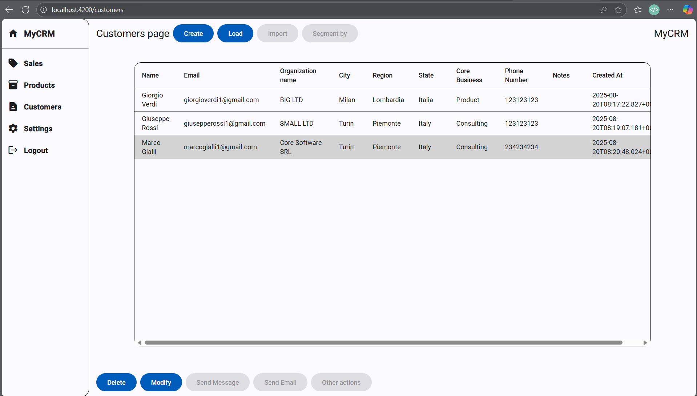

# MyCRM

This project is a simple CRUD application implementing a small CRM with the page of Sales, Products and Customers.

This project doesn't pretend to be professional or for commercial purposes as simple as it is.

Here you can find some screeshots from the live project.

**Login page** - An illustration of the Login page

**Home Page** - An illustration of the Home Page

**Product Page** - An illustration of the Product Page

**Create New Product Modal** - An illustration of the Create New Product Modal

**Customer Page** - An illustration of the Customer Page

**Add New Customer Modal** - An illustration of the login page

**Sales Page** - An illustration of the Sales Page

**Create New Sale Modal** - An illustration of the Create New Sale Modal

**Settings Page** - An illustration of the Settings Page

# MyCRM - en

Project for Demonstration and Non-Commercial Purposes

This project was developed entirely by me as a form of practice following a period of self-study.

The purpose of the project is to demonstrate the skills I have acquired, both from a development perspective (frontend - Angular, and backend - Spring Boot) and from an organizational standpoint (based on the free version of Jira software).

The project will be deployed on Amazon AWS cloud platform as an integral part of the acquired skills, but it will be accessible only upon request due to the platform’s operational costs.

You may not use the software in any way.

# MyCRM - it

Progetto a scopo dimostrativo e non commerciale.

Questo progetto è stato sviluppato interamente da me, come forma di pratica dopo un periodo di studio personale.

Il progetto ha il fine di dimostrare le competenze acquisite, dalla prospettiva sviluppo (frontend-Angular e backend-Spring Boot) e dalla prospettiva organizzativa (basata su software Jira in versione free).

Il progetto verrà rilasciato su piattaforma cloud amazon aws, come parte integrante delle competenze acquisite, ma visibile soltanto su richiesta, dati i costi di gestione della piattaforma stessa.

Non puoi usare il software in alcun modo.